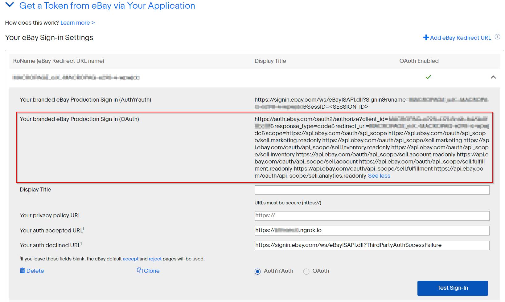
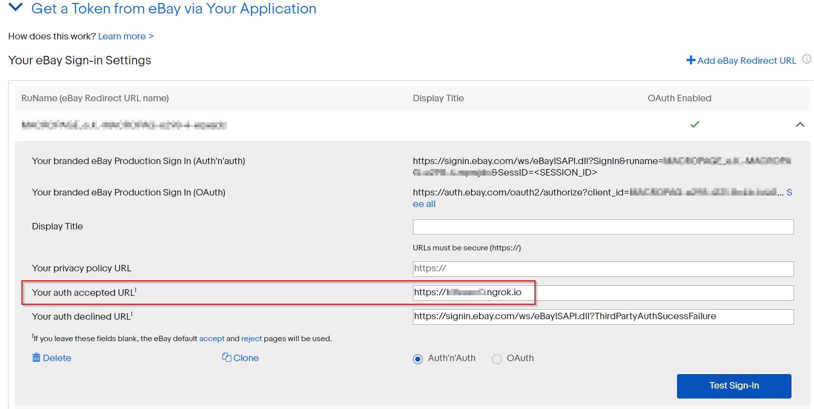
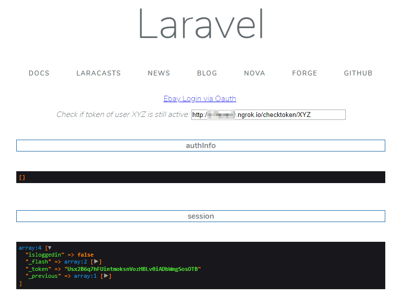
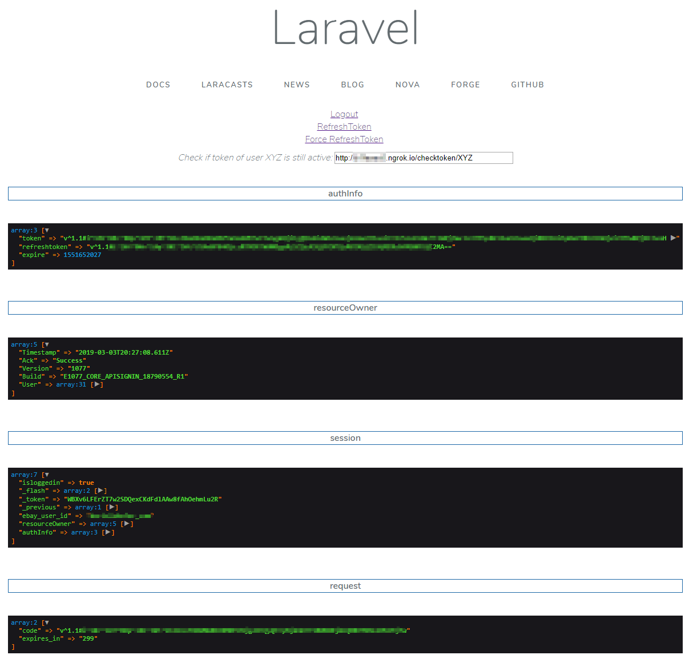
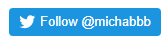

# ebay-oauth-playground
A simple playground for Ebay oAuth with the help of Laravel

### Howto

#### install dependencies

`composer update`


#### add config keys to .env

```
EBAY_APP_ID="xxxxxxxxxx"
EBAY_CERT_ID="xxxxxxxx"
EBAY_RU_NAME="xxxxxxx"
EBAY_OAUTH_LOGIN_URL="https://auth.ebay.com/oauth2/authorize?client_id=xxxxxxxxxx&response_type=code&redirect_uri=xxxxxxxxx&scope=https://api.ebay.com/oauth/api_scope https://api.ebay.com/oauth/api_scope/sell.marketing.readonly https://api.ebay.com/oauth/api_scope/sell.marketing https://api.ebay.com/oauth/api_scope/sell.inventory.readonly https://api.ebay.com/oauth/api_scope/sell.inventory https://api.ebay.com/oauth/api_scope/sell.account.readonly https://api.ebay.com/oauth/api_scope/sell.account https://api.ebay.com/oauth/api_scope/sell.fulfillment.readonly https://api.ebay.com/oauth/api_scope/sell.fulfillment https://api.ebay.com/oauth/api_scope/sell.analytics.readonly"
```

get `EBAY_OAUTH_LOGIN_URL` from here:



#### run laravel

`php artisan serve`

if you use docker: `php artisan serve --host 0.0.0.0`

#### setup https for localhost

https://hub.docker.com/r/wernight/ngrok

Update **Your auth accepted URL** at https://developer.ebay.com/my/auth?env=production&index=0&auth_type=oauth  
with your indiividual ngrok https URL



####  test routes

Route|method|example URL|notice
---|---|---|---
/|welcome|http://abcdefg.ngrok.io/|
/logout|logout|http://abcdefg.ngrok.io/logout|
/refresh|refreshtoken|http://abcdefg.ngrok.io/refreshtoken|only if token has **not** expired
/refresh|refreshtoken|http://abcdefg.ngrok.io/refreshtoken?force=1|refresh token **even it has not yet expired**
/checktoken/{userid}|checktoken|http://abcdefg.ngrok.io/checktoken/ebay_user2019|

#### token store

Key|Session|Disk
---|---|---
authInfo|x|storage/app/ebay_tokeninfo_{userid}
resourceOwner|x|storage/app/ebay_userinfo_{userid}

### What you should see when you call

###### https://abcdefg.ngrok.io/



###### Ebay Login via Oauth



### Notice

**keep in mind:** ebay returns `refresh_token_expires_in` (seconds) but `league/oauth2-client`  
shows us `expire` (seconds since 01.01.1970) which is a timestamp you can verify with https://www.unixtimestamp.com.  
because we have a real timestamp now, we can use `hasExpired` to verify, if the token has expired or not.

### You need help with the Ebay API?

**hire me:** `info@macropage.de`

[](https://twitter.com/michabbb)  

[](https://www.linkedin.com/in/macropage/)

[](https://xing.com/profile/Michael_Bladowski/cv)

